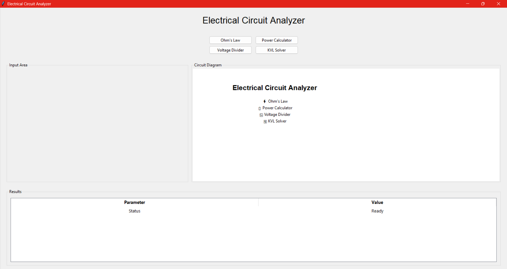

# Electrical Circuit Analyzer

A Python-based desktop application for analyzing basic electrical circuits using a graphical user interface (GUI).

## Live Demo

▶ YouTube Demo:
[https://youtube.com/your-video-link](https://youtu.be/lcotBCB8pgc)

### Ohm's Law Calculator

* Calculate voltage using current and resistance.
* Simple and intuitive user interface.

### Power Calculator

Supports multiple power calculation methods:

* P = V × I
* P = I² × R
* P = V² / R

### Voltage Divider Analyzer

* Calculates output voltage.
* Calculates divider current.
* Calculates power dissipation in resistors.

### Two-Loop KVL Solver

* Solves two-loop electrical circuits using Kirchhoff's Voltage Law (KVL).
* Computes loop currents.
* Calculates current through shared components.
* Calculates power dissipation in each resistor.

### Circuit Visualization

* Interactive circuit diagrams for supported analyses.
* Visual representation of voltage divider and KVL circuits.

### Dynamic Results Table

* Structured display of calculation results.
* Easy-to-read engineering-style output.

---

## Technologies Used

* Python 3
* Tkinter
* ttk
* NumPy

---

## Project Structure

```text
Electrical-Circuit-Analyzer/
│
├── circuit_analyzer.py
├── calculations.py
├── requirements.txt
├── README.md
├── .gitignore
│
├── screenshots/
│   ├── home.png
│   ├── ohms_law.png
│   ├── power_calculator.png
│   ├── voltage_divider.png
│   └── kvl_solver.png
│
└── assets/
```

## Installation

Clone the repository:

```bash
git clone https://github.com/yourusername/electrical-circuit-analyzer.git](https://github.com/Alve-jr-buet/Electrical-Circuit-Analyzer.git
```

Navigate to the project directory:

```bash
cd electrical-circuit-analyzer
```

Install dependencies:

```bash
pip install -r requirements.txt
```

Run the application:

```bash
python circuit_analyzer.py
```

---

## Example Applications

* Circuit analysis practice
* Electrical engineering education
* Learning Kirchhoff's Voltage Law
* Understanding voltage divider circuits
* Python GUI development practice

---

## Future Improvements

* N-loop mesh analysis
* Circuit file export
* CSV result export
* Dark mode interface
* Additional circuit analysis tools
* Enhanced circuit visualization

## Screenshots

### Home Screen



### Ohm's Law


### Power Calculator


### Voltage Divider


### KVL Solver


## Author

Developed by MONEM TAZUAR ALVE(GITHUB : Alve-jr-buet) as a Python and Electrical Engineering learning project.

## License

This project is open-source and available under the MIT License.
